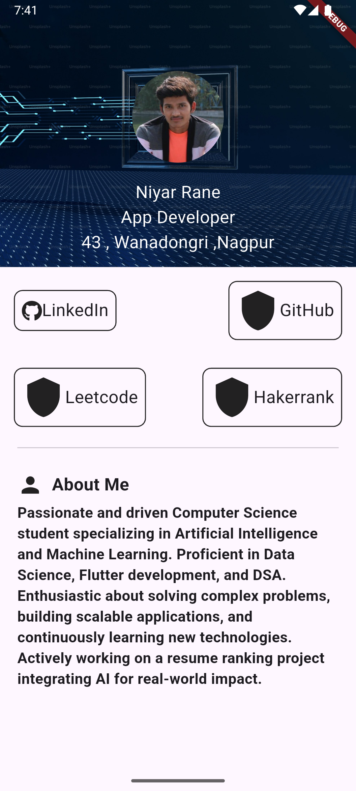

# Personal Portfolio App - Flutter  

## 📌 Overview  
This is a simple **Personal Portfolio App** built using **Flutter** as a practice project. The primary focus of this project is to understand **UI design, layout structuring, and Flutter widgets** rather than implementing navigation or backend functionality.  

## 🎯 Features  
- **Profile Section**: Displays name, designation, and location.  
- **Social Links**: Buttons for LinkedIn, GitHub, LeetCode, and HackerRank (not yet functional).  
- **About Me Section**: A brief introduction highlighting skills and current projects.  

## 🛠️ Tech Stack  
- **Framework**: Flutter  
- **Language**: Dart  
- **Widgets Used**: Column, Row, Card, Container, Text, IconButton, Image, etc.  

## 🏗️ Learning Outcomes  
- **UI Design in Flutter**: Implementing layout structure using **Container, Column, and Row** widgets.  
- **Styling & Theming**: Applying custom styling using **BoxDecoration, TextStyle, and Colors**.  
- **Widget Structuring**: Understanding how to create reusable widgets for efficient UI development.  
- **Basic State Management**: Managing simple UI states and interactions.  

## 📌 Future Improvements  
- Add navigation to external links (LinkedIn, GitHub, etc.).  
- Implement **animations and responsiveness** for better UI/UX.  
- Integrate a backend to fetch dynamic data.  

## 📷 Screenshot  
  

## 🚀 How to Run  
1. Clone the repository:  
   ```bash
   git clone <your-repo-link>
